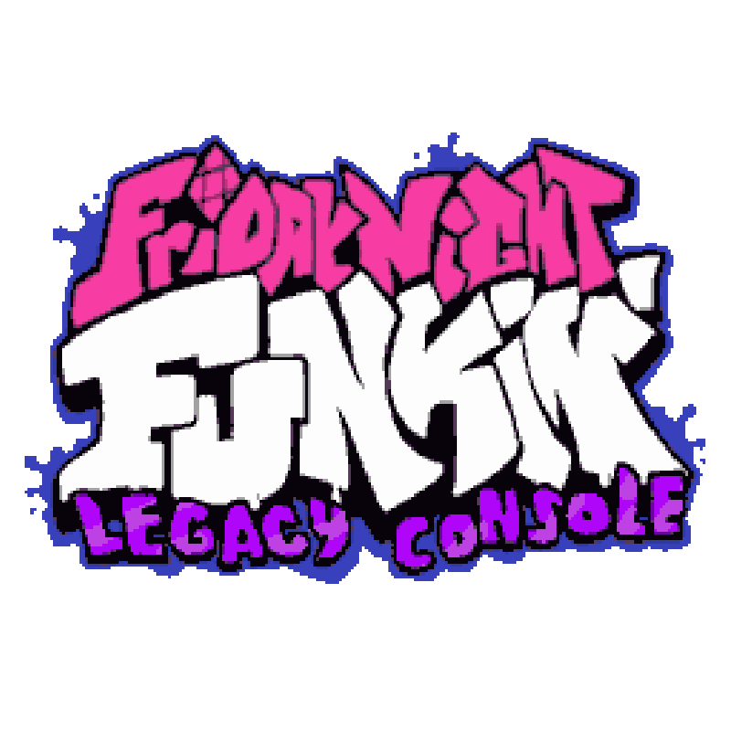
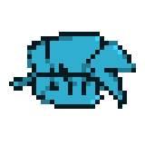

# FNFLC

Hello! This project is not affiliated with Newgrounds or Funkin' Crew Inc. It is a completely fan-made, non-profit project.

####  Friday Night Funkin' Legacy Console (FNFLC) is a fan-made project dedicated to porting Friday Night Funkin' to various retro gaming consoles, ranging from 8-bit to 32-bit systems. 

## Supported Platforms:
### Handhelds
* **8-Bit:** None
* **16-Bit:** None
* **32-Bit:** Nintendo Game Boy Advance, Nintendo DS

## 👥 Credits 

* **Frostier71** - Programmer and Artist

## The Funkin' Crew (Original Creators) 
* **[ninjamuffin99](https://github.com)** - Lead Programmer
* **[PhantomArcade](https://x.com)** - Lead Animator & Artist
* **[evilsk8r](https://x.com)** - Artist
* **[Kawai Sprite](https://x.com)** - Musician / Composer

## Official Game Links
* **Play on Newgrounds:** [Friday Night Funkin' on Newgrounds](https://newgrounds.com)
* **Support on Itch.io:** [Friday Night Funkin' on Itch.io](https://itch.io)
* **Source Code:** [Original GitHub Repository](https://github.com/Funkin)
